# SlimX Architecture

> Reflects `v0.7.2`. SlimX is a tiny, inspectable Python library for LLM calls with
> separated high-level and low-level APIs, multi-provider support, streaming, tools,
> and structured output. The high-level API targets "1-minute productivity"; the
> low-level API exposes explicit systems-builder primitives.

The diagrams below render natively on GitHub. On the documentation site they render
via the `pymdownx.superfences` mermaid fence configured in `mkdocs.yml`.

## 1. Big picture architecture

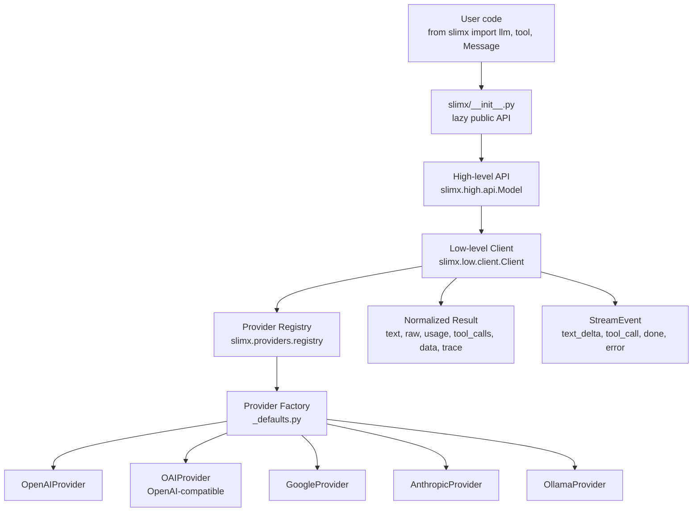

The top-level `slimx` package is mostly a **lazy facade**. It exposes names like
`llm`, `Model`, `Message`, `Result`, `Client`, `ChatRequest`, `tool`, and provider
functions, but it does not import everything immediately. This avoids provider
bootstrapping side effects, speeds up imports, and helps prevent circular imports.
The lazy mapping points `llm` and `Model` to `slimx.high.api`, `Client` and
`ChatRequest` to `slimx.low`, and provider functions to `slimx.providers.registry`.

## 2. The core data model

SlimX models the conversation and provider results through a small set of canonical
dataclasses.

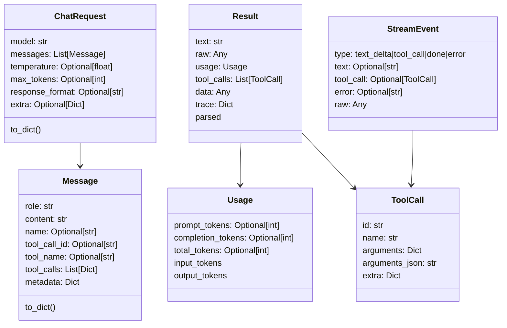

`Message` is the canonical provider-neutral message object. It supports normal roles
such as `system`, `user`, and `assistant`, but it also carries tool-specific fields
such as `tool_call_id`, `tool_name`, and assistant-side `tool_calls`. This matters
because providers represent tool calls differently, so SlimX keeps one internal shape
and lets adapters translate it.

`ChatRequest` is the low-level input contract. It contains the model, messages,
temperature, max token limit, response format, and an `extra` dictionary that acts as
a provider-specific escape hatch. Its `to_dict()` serializes messages and merges
`extra` into the outgoing request representation.

`Result` is the normalized output contract. It always exposes `text`, `raw`, `usage`,
`tool_calls`, optional parsed `data`, and a `trace` dictionary (`parsed` is a
read-only alias of `data`). This mirrors the public response structure documented in
the README.

`ToolCall` is designed to survive provider differences. It stores both a dict form of
arguments and a canonical JSON string form, and it includes `extra` for opaque
provider-specific data that must be round-tripped, such as Gemini's `thoughtSignature`.

`Usage` exposes the OpenAI-style `prompt_tokens`/`completion_tokens`/`total_tokens`
fields. `input_tokens` and `output_tokens` are **read-only property aliases** (not
stored fields) for provider-neutral naming; fields are populated only when a provider
reports them and are otherwise `None`.

## 3. High-level API: `llm(...)`, `Model`, `.json()`, `.stream()`

The high-level API lives in `slimx/high/api.py`.

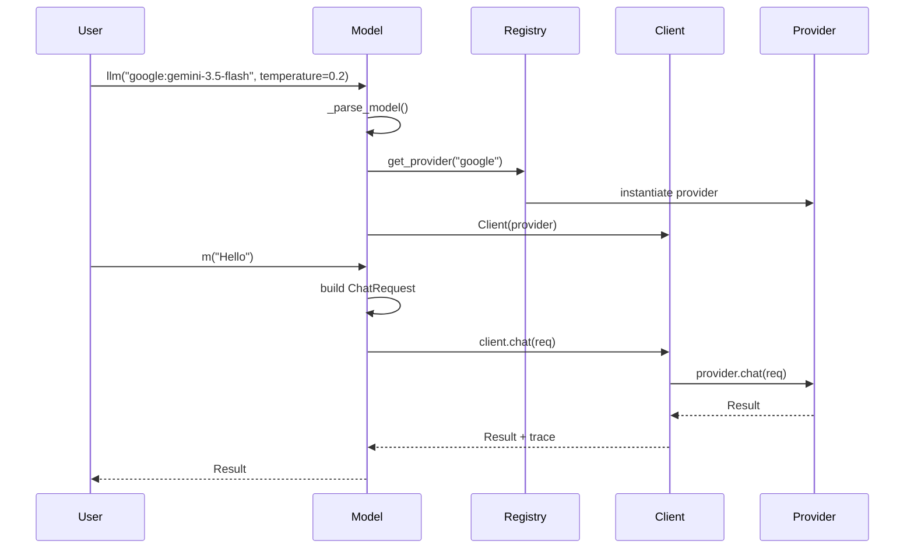

`_parse_model()` splits strings like `google:gemini-3.5-flash` into provider name and
model name. If there is no prefix, it defaults to `openai`.

`Model.__init__()` resolves the provider through `get_provider(...)`, builds a
low-level `Client`, and stores defaults like model name, temperature, max tokens,
tools, timeout, and retries. Calling the model builds a `ChatRequest` with a single
user `Message` and delegates to `Client.chat(...)`.

`.stream()` is similar, but calls `Client.stream(...)` and returns normalized
`StreamEvent` objects. `.json()` is SlimX's structured output helper. It converts a
dataclass or dict schema into a JSON schema prompt, sets
`response_format="json_object"`, sends the request, parses the model text as JSON, and
optionally coerces it back into the dataclass.

> **Single-prompt by design.** `Model.__call__`, `.stream`, and `.json` accept a
> single `prompt: str` and wrap it in one user message. Multi-turn conversations
> (full message histories, prior tool turns) are constructed at the low level with
> `ChatRequest(messages=[...])` and `Client`. The high-level API is deliberately the
> "one prompt in, one result out" convenience layer. `m.capabilities` exposes the
> selected provider's `ProviderCapabilities`.

## 4. Low-level API: `Client` and `ChatRequest`

The low-level layer is where request execution, retry, trace, streaming, and tool
loops live.

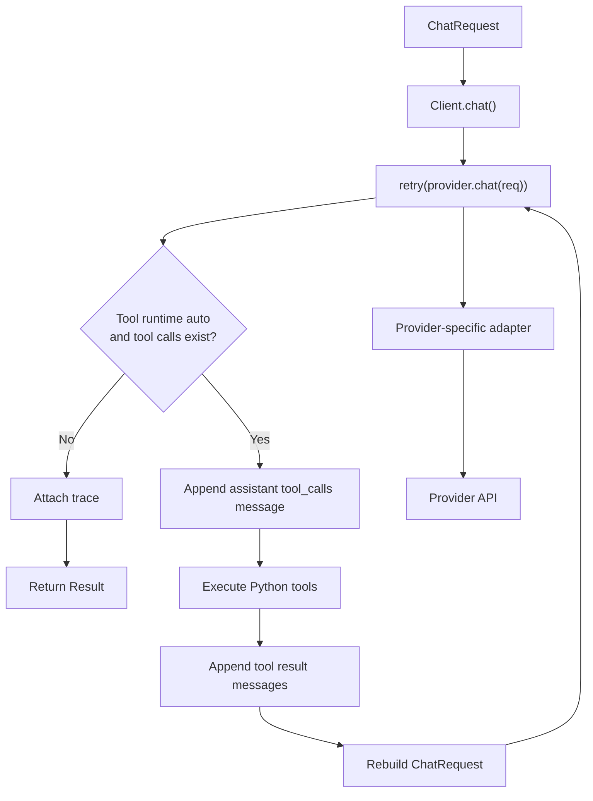

`Client.chat()` first builds a tool map, records start time, and calls
`provider.chat(...)` through the retry utility. If `tool_runtime` is not `"auto"` or
there are no tool calls, it attaches trace metadata and returns.

If auto tool execution is enabled, the client enters a loop. It appends an assistant
message containing the model's tool calls, executes the matching local Python
functions, appends tool result messages, rebuilds the `ChatRequest`, and calls the
provider again until no tool calls remain or `max_steps` is reached.

The trace added to every final result includes provider name, model, elapsed
milliseconds, retries, tool steps, tool call count, and timeout.

> **Retry is transient-only.** `retry()` / `async_retry()` (in `slimx/utils/retry.py`)
> retry only *transient* failures — rate limits, timeouts, and transport errors.
> Deterministic failures (auth errors, schema errors, tool-execution errors) are
> raised immediately rather than waiting through pointless backoff. The sync and async
> clients share this one policy.

## 5. Provider interface: `base.py`

The formal interface is defined by `Provider` in `slimx/providers/base.py`.

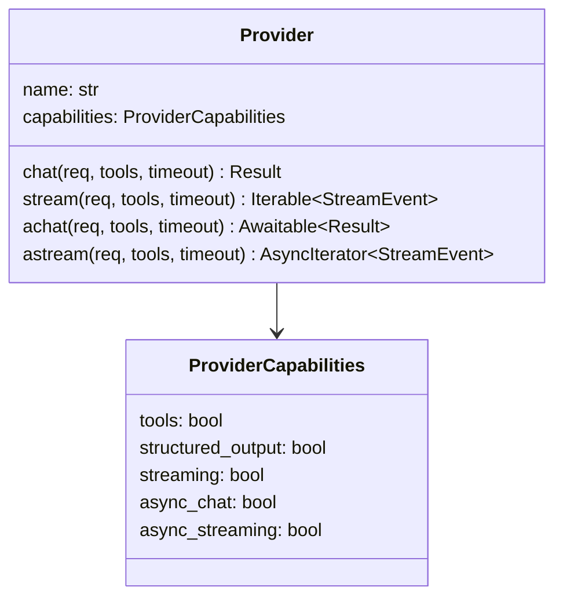

Every provider must implement `chat()` and `stream()`. Async methods are optional and
default to `NotImplementedError`. Capabilities are explicit booleans for tools,
structured output, streaming, async chat, and async streaming.

This is the key SlimX contract: the rest of the library does not care whether the
provider is OpenAI, Gemini, Ollama, Anthropic, or an OpenAI-compatible local server.
It only expects the provider to accept a `ChatRequest` and return a normalized
`Result` or `StreamEvent`. The contract is enforced by a shared **conformance suite**
(`tests/conformance/`) that every built-in provider is run against, offline.

## 6. Registry, defaults, factories, and plugins

The provider registry is split into three ideas:

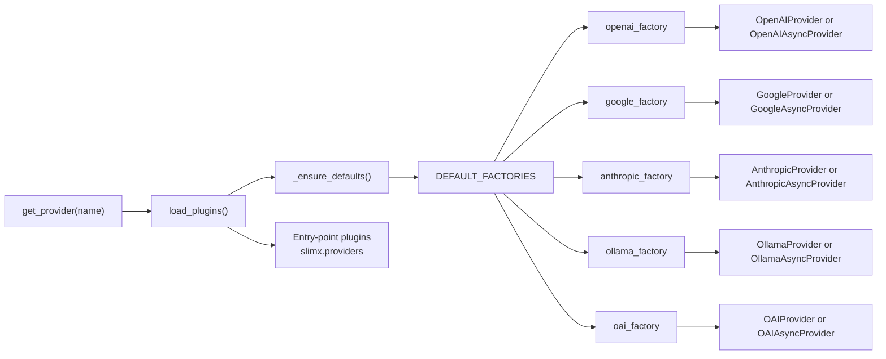

`registry.py` maintains `_REGISTRY`, registers defaults lazily, loads plugin
providers, lists providers, and returns provider instances. It also exposes
`describe_provider(name, async_mode=False)`, which reports a provider's declared
capabilities without requiring an API key or a running server.

`_defaults.py` contains the built-in provider factories. The factories read API keys
and base URLs from arguments or environment variables, choose sync or async provider
classes based on `async_mode`, and instantiate the correct provider. The default
provider map registers `openai`, `anthropic`, `ollama`, `google`, and `oai`.

`plugins.py` loads third-party provider factories from the Python entry-point group
`slimx.providers`. This is why external providers can be added without modifying the
core package; the project metadata declares the `slimx.providers` entry-point group
for third-party providers.

## 7. Provider adapters and payload builders

Each provider adapter does three jobs:

1. Convert `ChatRequest` into that provider's request payload.
2. Send an HTTP request using `httpx`.
3. Convert the provider-specific response into a SlimX `Result` or `StreamEvent`.

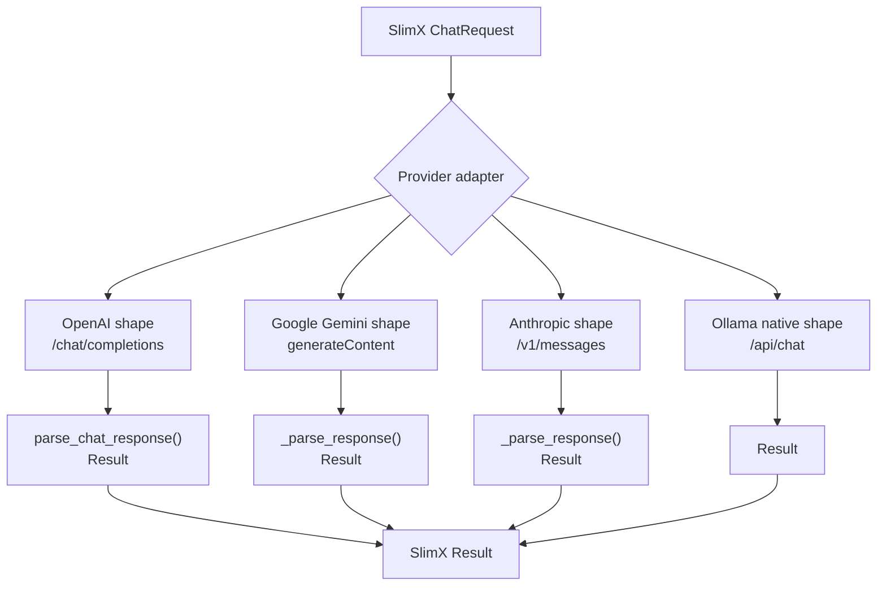

### OpenAI and OpenAI-compatible

OpenAI uses shared helpers in `_openai_shape.py`. `build_payload()` starts from
`req.to_dict()`, adds tools if present, converts `response_format="json_object"` into
OpenAI's `{"type": "json_object"}`, and sets `"stream": True` for streaming.

`parse_chat_response()` extracts assistant text, parses OpenAI-style tool calls,
converts usage, and returns a SlimX `Result`. `OpenAIProvider.chat()` calls
`build_payload()`, posts to `/chat/completions`, checks status, and parses the
response. `OAIProvider` simply subclasses `OpenAIProvider` and changes the provider
name to `"oai"`, because local/self-hosted servers speak the same OpenAI-compatible
API shape. Keeping this logic in one shared module is what prevents the sync and async
OpenAI providers from drifting apart.

### Google Gemini

Google has a more complex adapter because Gemini's request structure is different. The
provider declares tools, structured output, and streaming support.
`GoogleProvider.chat()` builds a Gemini payload, calls `models/{model}:generateContent`,
and parses the response.

The Google payload builder converts SlimX messages into Gemini `contents` plus optional
`systemInstruction`, preserves the request's provider-specific `extra`, maps
temperature/max tokens into `generationConfig`, sets `responseMimeType="application/json"`
for JSON output, and converts SlimX tools into Gemini function declarations.

The adapter also handles Gemini function calls and the special `thoughtSignature`
round-trip requirement (Gemini 3+) by storing the signature inside `ToolCall.extra` at
parse time and replaying it onto the function-call part on the next turn.

### Anthropic

Anthropic uses its own `_build_payload()`. It separates system messages, converts
messages to Anthropic's Messages API format, sets `max_tokens`, forwards temperature,
and converts SlimX tools into Anthropic `input_schema` declarations.

Anthropic's message conversion also handles the auto-tool-loop format: assistant
messages contain OpenAI-style `tool_calls`, while SlimX tool results arrive as `tool`
messages; the adapter merges consecutive tool results into a single user turn to
maintain Anthropic's required user/assistant alternation.

### Ollama

Ollama uses the native `/api/chat` endpoint. Its `_payload()` maps SlimX messages into
Ollama messages, sets `"stream"`, and maps `temperature` and `max_tokens` into Ollama
`options`, specifically `num_predict`. The native provider declares streaming support
but not tools or structured output.

## 8. Tooling model

Tools are defined with the `@tool` decorator.

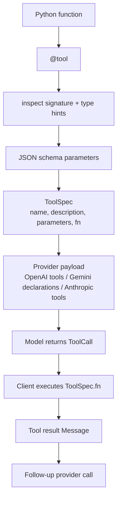

`ToolSpec` stores the tool name, description, JSON-schema parameters, and callable. The
`tool()` decorator reads the Python function name, docstring, signature, and type
hints, builds a JSON-schema-like object, and rejects `*args` / `**kwargs`. When a model
requests a tool, `Client.chat()` executes the matching `ToolSpec.fn` and sends the
result back as a `Message.tool(...)`.

## 9. Structured output and schema modelling

SlimX's schema system is intentionally lightweight. It converts Python dataclasses and
type hints into JSON schema, supports primitive types, lists, dicts, optionals
(including PEP 604 `X | None`), nested dataclasses, and falls back to strings for
unknown types.

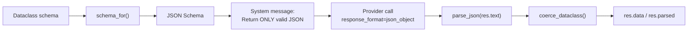

`schema_for()` accepts a dataclass type or instance, resolves type hints with
`typing.get_type_hints` (so it works under `from __future__ import annotations`), builds
`properties`, computes `required`, and sets `additionalProperties=False`.
`coerce_dataclass()` then converts plain dicts back into dataclass instances,
recursively handling nested dataclasses, lists, dicts, and light, best-effort scalar
coercion.

## 10. Streaming model

Streaming is normalized through `StreamEvent`.

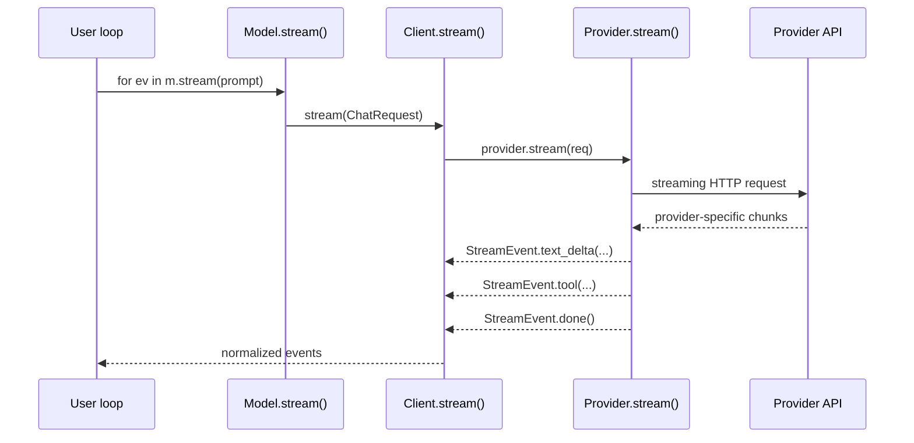

`StreamEvent` has four event types: `text_delta`, `tool_call`, `done`, and `error`.
OpenAI streaming uses SSE chunks and a `StreamToolAccumulator` to reassemble streamed
tool-call deltas (keyed by `index`, since OpenAI sends the id only in the first delta)
before emitting final tool-call events. Google streams SSE from
`streamGenerateContent?alt=sse`, yielding text deltas and tool-call events as they
arrive. Ollama streams NDJSON from `/api/chat` and yields `text_delta` events until
`done`.

## 11. Capability declarations and conformance

Each provider declares what it supports using `ProviderCapabilities`. Providers must not
claim capabilities they do not implement, and the conformance suite enforces this: a
provider is only exercised for a capability it declares.

| Provider         | Tools | Structured output | Streaming |     Async |
| ---------------- | ----: | ----------------: | --------: | --------: |
| `openai` / `oai` |   Yes |               Yes |       Yes |       Yes |
| `google`         |   Yes |               Yes |       Yes |       Yes |
| `anthropic`      |   Yes |                No |   wrapper | chat only |
| `ollama`         |    No |                No |       Yes |       Yes |

Anthropic chat and tool calling are fully supported. Native token streaming is not yet
implemented; the sync `stream()` is a compatibility wrapper that emits the full result
as a single `text_delta` followed by `done`. The async provider declares
`async_streaming=False` for the same reason — `astream` exists only as the same
emulated wrapper, so streaming code still works against Anthropic without
special-casing.

## 12. How data flows end-to-end

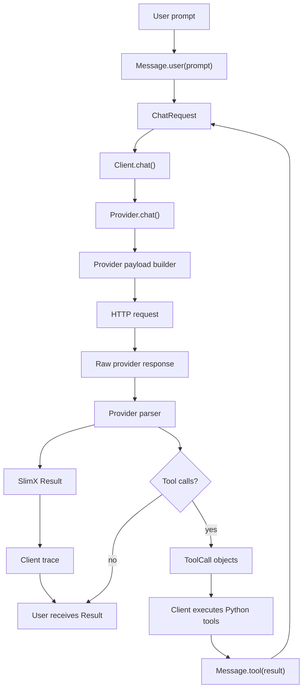

The important design idea is that **SlimX keeps the internal model stable** and pushes
provider weirdness to the edges:

- Internally: `Message`, `ChatRequest`, `ToolSpec`, `ToolCall`, `Result`, `StreamEvent`.
- At the edge: provider-specific payload builders and parsers.
- Around execution: `Client` handles retries, tool loops, tracing, and sync/async delegation.
- At the top: `Model` makes the library easy to use.

## 13. Mental model for development

Think of SlimX as three layers:

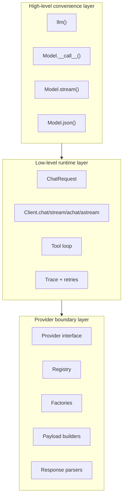

For adding or modifying providers, the safest development rule is: **never let
provider-specific shapes leak into the public API.** Convert everything at the provider
boundary into SlimX's canonical `Result`, `StreamEvent`, `ToolCall`, and `Usage`.

OpenAI-compatible providers reuse the OpenAI shape helper, Google has a custom Gemini
mapping layer, Anthropic has a custom Messages API mapper, and Ollama has a native
`/api/chat` mapper — exactly the right separation of concerns. See
[`DEVELOPMENT.md`](DEVELOPMENT.md) for the engineering charter, the full Provider
Contract, and the roadmap.
